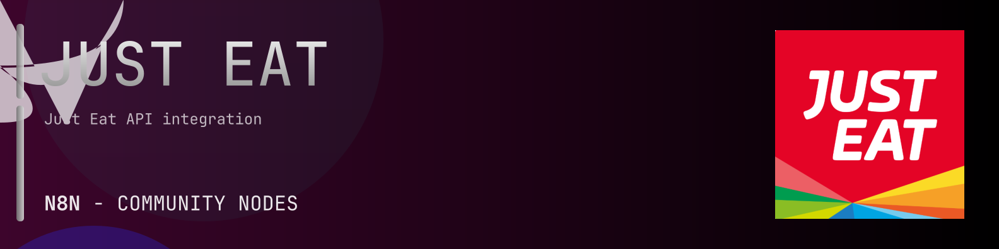

# @n8n-dev/n8n-nodes-just-eat



[](https://www.npmjs.com/package/@n8n-dev/n8n-nodes-just-eat)
[](https://opensource.org/licenses/MIT)

---

**Stop writing just-eat API integrations by hand.**

Every time you connect n8n to just-eat, you waste hours mapping endpoints, defining parameters, and debugging schemas. You copy-paste from docs, fix edge cases, and pray nothing breaks.

**What if connecting n8n to just-eat took 5 minutes, not half a day?**

This node gives you **24+ resources** out of the box: **Order Acceptance Webhooks**, **Publicly Accessible**, **Attempted Delivery Webhooks**, **Checkout**, **Consumers**, and 19 more: with full CRUD operations, typed parameters, and zero manual configuration.

---

## What You Get

- **Zero boilerplate**: Resources, operations, and fields are pre-configured and ready to use
- **Full CRUD**: Create, read, update, and delete support where the API allows it
- **Typed parameters**: No more guessing field types
- **Built-in auth**: API key authentication, ready to go
- **Declarative**: Native n8n performance, no custom execute() overhead

---

## Install

```bash
npm install @n8n-dev/n8n-nodes-just-eat
```

**Or in n8n:**
1. **Settings → Community Nodes → Install**
2. Search: `@n8n-dev/n8n-nodes-just-eat`
3. Click **Install**

---

## Quick Start

1. Install the node (above)
2. Add credentials: **just-eat API** → paste your API key
3. Drag the **just-eat** node into your workflow
4. Pick a resource → pick an operation → done.

That's it. No configuration files. No code. It just works.

---

## Resources

<details>
<summary><b>Order Acceptance Webhooks</b> (5 operations)</summary>

- Post Acceptance requested
- Post Order accepted
- Post Order cancelled
- Post Order rejected
- Put Customer Requested Redelivery

</details>

<details>
<summary><b>Publicly Accessible</b> (93 operations)</summary>

- Post Acceptance requested
- Put Attempted delivery query resolved
- Get Checkout
- Patch Update Checkout
- Get Available Fulfilment Times
- Get consumers details
- Post Create consumer
- Get communication preferences
- Put Set only the channel subscriptions for a given consumer s communication preference type
- Delete Remove subscription of a specific communication preference channel
- Post Subscribe to a specific communication preference channel
- Put Delivery Attempt Failed
- Get restaurant delivery fees
- Get your delivery pools
- Post Create a new delivery pool
- Delete a delivery pool
- Patch Modify a delivery pool
- Put Replace an existing delivery pool
- Get availability for pickup
- Put Set availability for pickup
- Put Set the delivery pools daily start and end times
- Delete Remove restaurants from a delivery pool
- Put Add restaurants to an existing delivery pool
- Put Driver Assigned to Delivery
- Put Driver at delivery address
- Put Driver at restaurant
- Put Driver has delivered order
- Put Driver Location
- Put Driver on their way to delivery address
- Post late order compensation query restaurant response required
- Post late order query restaurant response required
- Post Menu ingestion complete
- Post Order accepted
- Post Order cancelled
- Post Order Eligible For Restaurant Compensation
- Put Order ready for pickup
- Post Order ready for preparation async
- Post Order ready for preparation sync
- Post Order rejected
- Put Order requires delivery acceptance
- Post Order time updated
- Post Create order
- Put Update current driver locations bulk upload
- Put Accept order
- Put Cancel order
- Post Complete order
- Put Update order with driver at delivery address details
- Put Update order with driver at restaurant details
- Put Update the driver s estimated time to arrive at the Restaurant
- Put Update order with delivered details
- Put Update order with driver assigned details
- Put Update order with driver unassigned details
- Put Update order with driver on its way details
- Put Update order ETA
- Put Ignore order
- Post Mark order as ready for collection
- Put Reject order
- Post Response to Late Order Update Request
- Post Update late order compensation request with Restaurant response
- Post Create Compensation requests
- Put Customer Requested Redelivery
- Put Restaurant Offline Status
- Put Restaurant Online Status
- Get restaurants by location
- Get restaurants by postcode
- Put Set ETA for pickup
- Get product catalogue
- Get all availabilities
- Get all categories
- Get all category item IDs
- Get all menu items
- Get all menu item deal groups
- Get all deal item variations for a deal group
- Get all menu item modifier groups
- Get all menu item variations
- Get claims
- Post Submit a restaurant response for the claim
- Put Add reason and comments to the response
- Get Restaurant Fees
- Put Create or Update Restaurant Fees
- Get the latest version of the restaurant s full menu
- Put Create or update a menu
- Get the restaurant s delivery and collection lead times
- Put Update the restaurant s delivery and collection lead times
- Get service times
- Put Create or update service times
- Get auto completed search terms
- Get Search restaurants
- Post Send to POS failed
- Post Create Offline Event
- Delete Offline Event
- Post Delivery Attempt Failed
- Post Request Redelivery of the Order

</details>

<details>
<summary><b>Attempted Delivery Webhooks</b> (2 operations)</summary>

- Put Attempted delivery query resolved
- Put Delivery Attempt Failed

</details>

<details>
<summary><b>Checkout</b> (3 operations)</summary>

- Get Checkout
- Patch Update Checkout
- Get Available Fulfilment Times

</details>

<details>
<summary><b>Consumers</b> (6 operations)</summary>

- Get consumers details
- Post Create consumer
- Get communication preferences
- Put Set only the channel subscriptions for a given consumer s communication preference type
- Delete Remove subscription of a specific communication preference channel
- Post Subscribe to a specific communication preference channel

</details>

<details>
<summary><b>Delivery Fee</b> (1 operations)</summary>

- Get restaurant delivery fees

</details>

<details>
<summary><b>Order Delivery API</b> (8 operations)</summary>

- Put Update current driver locations bulk upload
- Put Update order with driver at delivery address details
- Put Update order with driver at restaurant details
- Put Update the driver s estimated time to arrive at the Restaurant
- Put Update order with delivered details
- Put Update order with driver assigned details
- Put Update order with driver unassigned details
- Put Update order with driver on its way details

</details>

<details>
<summary><b>Delivery Pools API</b> (10 operations)</summary>

- Get your delivery pools
- Post Create a new delivery pool
- Delete a delivery pool
- Patch Modify a delivery pool
- Put Replace an existing delivery pool
- Get availability for pickup
- Put Set availability for pickup
- Put Set the delivery pools daily start and end times
- Delete Remove restaurants from a delivery pool
- Put Add restaurants to an existing delivery pool

</details>

<details>
<summary><b>Order Delivery Webhooks</b> (8 operations)</summary>

- Put Driver Assigned to Delivery
- Put Driver at delivery address
- Put Driver at restaurant
- Put Driver has delivered order
- Put Driver Location
- Put Driver on their way to delivery address
- Put Order ready for pickup
- Put Order requires delivery acceptance

</details>

<details>
<summary><b>Consumer Queries Webhooks</b> (2 operations)</summary>

- Post late order compensation query restaurant response required
- Post late order query restaurant response required

</details>

<details>
<summary><b>Restaurant Webhooks</b> (2 operations)</summary>

- Post Menu ingestion complete
- Post Order time updated

</details>

<details>
<summary><b>Restaurant Queries Webhooks</b> (1 operations)</summary>

- Post Order Eligible For Restaurant Compensation

</details>

<details>
<summary><b>Order Webhooks</b> (3 operations)</summary>

- Post Order ready for preparation async
- Post Order ready for preparation sync
- Post Send to POS failed

</details>

<details>
<summary><b>Order API</b> (1 operations)</summary>

- Post Create order

</details>

<details>
<summary><b>Order Acceptance API</b> (7 operations)</summary>

- Put Accept order
- Put Cancel order
- Post Complete order
- Put Update order ETA
- Put Ignore order
- Post Mark order as ready for collection
- Put Reject order

</details>

<details>
<summary><b>Consumer Queries</b> (2 operations)</summary>

- Post Response to Late Order Update Request
- Post Update late order compensation request with Restaurant response

</details>

<details>
<summary><b>Restaurant Queries</b> (1 operations)</summary>

- Post Create Compensation requests

</details>

<details>
<summary><b>Restaurant Events Webhooks</b> (2 operations)</summary>

- Put Restaurant Offline Status
- Put Restaurant Online Status

</details>

<details>
<summary><b>Restaurants</b> (18 operations)</summary>

- Get restaurants by location
- Get restaurants by postcode
- Put Set ETA for pickup
- Get product catalogue
- Get all availabilities
- Get all categories
- Get all category item IDs
- Get all menu items
- Get all menu item deal groups
- Get all deal item variations for a deal group
- Get all menu item modifier groups
- Get all menu item variations
- Get Restaurant Fees
- Put Create or Update Restaurant Fees
- Get the latest version of the restaurant s full menu
- Put Create or update a menu
- Get service times
- Put Create or update service times

</details>

<details>
<summary><b>Restaurant Claims</b> (3 operations)</summary>

- Get claims
- Post Submit a restaurant response for the claim
- Put Add reason and comments to the response

</details>

<details>
<summary><b>Restaurant Order Times</b> (2 operations)</summary>

- Get the restaurant s delivery and collection lead times
- Put Update the restaurant s delivery and collection lead times

</details>

<details>
<summary><b>Search</b> (2 operations)</summary>

- Get auto completed search terms
- Get Search restaurants

</details>

<details>
<summary><b>Restaurant Events</b> (2 operations)</summary>

- Post Create Offline Event
- Delete Offline Event

</details>

<details>
<summary><b>Attempted Delivery API</b> (2 operations)</summary>

- Post Delivery Attempt Failed
- Post Request Redelivery of the Order

</details>

---

## Why This Node?

**Without this node:**
- Hours of manual API integration
- Copy-pasting from just-eat docs
- Debugging auth, pagination, error handling
- Maintaining your own client code

**With this node:**
- Install → configure → use. 5 minutes.
- Auto-generated from the official just-eat OpenAPI spec
- Always up to date when the API changes
- Native n8n performance

---

## Auto-Generated
This node was auto-generated from the official **just-eat** OpenAPI specification using
[@n8n-dev/n8n-openapi-node-ultimate](https://github.com/kelvinzer0/n8n-openapi-node-ultimate),
then validated against the live API so you get accurate types and real parameters, not guesswork.

When the just-eat API updates, this node updates too.

---


## License

MIT © [kelvinzer0](https://github.com/n8n-code)
